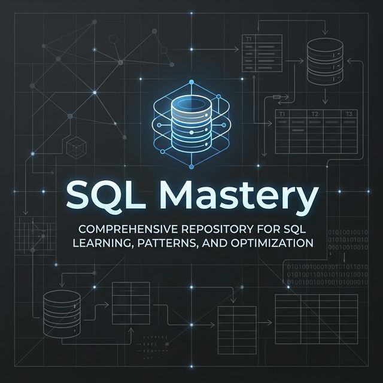

<div align="center">



# 🏁 THE COMPLETE SQL MASTERY NOTES

### *The definitive, 10/10 professional-grade guide to SQL and MySQL*
**80+ Topics | 16 Structured Phases | From Zero to Advanced Analytics**

<br/>


<br/>

---

### "Don't just write queries. Master the engine."

> *These notes were built to fill the gap between 'online tutorials' and 'real-world engineering'. We don't just teach you how to write a SELECT statement; we teach you how the database optimizer parses it, caches it, and retrieves it from the disk.*

---

</div>

<br/>

## 💎 The "10/10 Mastery" Standard

Regular notes just give you syntax. These notes follow a strict **8-point professional standard** for every single topic:

1.  **📌 Definition:** Jargon-free explanation in plain English.
2.  **💡 Why It Exists:** The real-world business problem this concept solves.
3.  **⚙️ Internal Mechanics (PRO):** How the database engine (InnoDB/MySQL) handles it under the hood (B+ Trees, MVCC, WAL).
4.  **💻 Syntax Cheat Sheet:** Clean, copy-pasteable SQL examples.
5.  **🌍 Real-Life Examples:** 2-3 business scenarios (E-commerce, Banking, HR, Social Media).
6.  **❌ Common Mistakes:** A dedicated section on what beginners (and even seniors) get wrong.
7.  **✅ Best Practices:** Industry-standard tips for performance and security.
8.  **🏋️ Practice Tasks:** 3 hands-on tasks per topic to lock in your learning.

---

## 🗺️ The 16-Phase Journey

Follow this structured path to transform from a beginner to a database architect.

<details open>
<summary><strong>📘 Phase 01–05: The Foundation</strong></summary>

*The objective here is to understand 'The Soul' of a database before writing code.*

- **Phase 01:** [Database Fundamentals](./Phase_01_Database_Fundamentals/) — Why we don't use Excel for everything. Understanding DBMS vs. File Systems.
- **Phase 02:** [Data Models & Keys](./Phase_02_Data_Models_and_Keys/) — Learning the 'Blueprint' (ER Modeling) and how to identify records uniquely.
- **Phase 03:** [Sublanguages & Data Types](./Phase_03_SQL_Sublanguages_and_Data_Types/) — Organizing your SQL tools (DDL, DML, DQL) and picking the right types for your data.
- **Phase 04:** [DDL & Constraints](./Phase_04_DDL_and_Constraints/) — Building the skeleton. How to force data integrity with PKs, FKs, and Check constraints.
- **Phase 05:** [DML — Manipulation](./Phase_05_DML_Data_Manipulation_Language/) — The art of inserting, updating, and deleting data without breaking production.

</details>

<details>
<summary><strong>📗 Phase 06–09: Querying & Insights</strong></summary>

*Learn to extract raw data and turn it into information.*

- **Phase 06:** [DQL & Basic Filtering](./Phase_06_DQL_and_Basic_Filtering/) — Mastering SELECT. Understanding the **Logical Order of Execution** (FROM → WHERE → SELECT).
- **Phase 07:** [Advanced Filtering](./Phase_07_Advanced_Filtering_and_Sorting/) — Using REGEXP for pattern matching and LIMIT/OFFSET for high-performance pagination.
- **Phase 08:** [MySQL Functions](./Phase_08_MySQL_Built_in_Functions/) — Automating data formatting (String, Date, Math) directly in your queries.
- **Phase 09:** [Aggregations](./Phase_09_Aggregations_and_Grouping/) — Building reports for management using Group By, Having, and Rollups for multi-dimensional analysis.

</details>

<details>
<summary><strong>📙 Phase 10–12: Intermediate (Scaling Up)</strong></summary>

*Moving from one table to complex, interconnected systems.*

- **Phase 10:** [Multi-Table Joins](./Phase_10_Multi_Table_Queries_Joins/) — The heart of SQL. Mastering Inner, Left, Right, Self, and Cross Joins with Nested-Loop internals.
- **Phase 11:** [Set Ops & Subqueries](./Phase_11_Set_Operations_and_Subqueries/) — Recursive logic and set theory. Learning when to use `EXISTS` vs `IN` for performance.
- **Phase 12:** [Views & Indexes](./Phase_12_Views_and_Indexes/) — The "Turbo Button". Understanding B+ Trees and creating safe windows (Views) into your data.

</details>

<details>
<summary><strong>📕 Phase 13–16: Advanced (Production Engineer)</strong></summary>

*Topics covered by top 1% of SQL developers.*

- **Phase 13:** [Window Functions](./Phase_13_Window_Functions/) — Financial analytics like running totals, row ranking, and week-over-week growth.
- **Phase 14:** [Database Programming](./Phase_14_CTEs_and_Database_Programming/) — Master CTEs, Stored Procedures, and Triggers to automate complex business logic.
- **Phase 15:** [Transactions & Security](./Phase_15_Transactions_Admin_Security/) — Ensuring data safety with ACID properties, Locking, and the Principle of Least Privilege.
- **Phase 16:** [Normalization](./Phase_16_Database_Design_Normalization/) — The science of database design. 1NF to BCNF and when to purposely break the rules (Denormalization).

</details>

---

## 🛠️ Built With

These notes are optimized for **MySQL 8.0+** using the **InnoDB** storage engine. All code examples follow industry-standard SQL linting and are designed for maximum readability.

---

<br/>

## 🚀 Getting Started

### 1. Prerequisites
- **MySQL Community Server** (8.0+) — [Download Link](https://dev.mysql.com/downloads/mysql/)
- **MySQL Workbench** — Recommended GUI for testing the practice tasks.
- **A Curious Mind** — Every note is designed to be read in 10-15 minutes.

### 2. How to Clone & Use Locally
```bash
# Clone this repository to your computer
git clone https://github.com/Niranjan-Kumar-Singh/sql-mastery-notes.git

# Navigate into the folder
cd sql-mastery-notes
```

---

## 🤝 Found a Mistake? (How to Contribute)

I aim for 100% technical accuracy, but if you find a typo, a bug in the SQL code, or want to suggest a new "Pro-Level" section, follow these steps to contribute:

### 1. Fork the Repository
Click the **Fork** button at the top-right of this page to create a copy of this repository under your own GitHub account.

### 2. Clone Your Fork
Open your terminal and clone **your specific fork** (replace `YOUR-USERNAME` with your actual GitHub username):
```bash
git clone https://github.com/YOUR-USERNAME/sql-mastery-notes.git
cd sql-mastery-notes
```

### 3. Create a New Branch
Always create a separate branch for your fixes:
```bash
git checkout -b fix/topic-name
```

### 4. Make Your Changes & Commit
After fixing the mistake, commit your changes with a clear message:
```bash
git add .
git commit -m "Fix: Corrected typo in Topic 10.2 (Joins)"
```

### 5. Push & Submit a Pull Request
Push the changes to your fork and then click the **"Compare & pull request"** button on the original repository page.
```bash
git push origin fix/topic-name
```

*Your contribution will help this resource remain the best free SQL guide on the internet!*

---

<br/>

<div align="center">

## 👤 Meet the Author

### **Niranjan Kumar Singh**
*Data Enthusiast • Backend Developer • Master Learner*

<br/>

[](mailto:niranjansingh1419@gmail.com)
[](https://instagram.com/niranjan.ks.in)
[](https://github.com/Niranjan-Kumar-Singh)

<br/>

*"The best way to learn SQL is to write SQL.*
*Open Workbench. Run the code. Break things. Fix them."*

<br/>

⭐ **If these notes helped you, please star this repository!** ⭐

</div>
